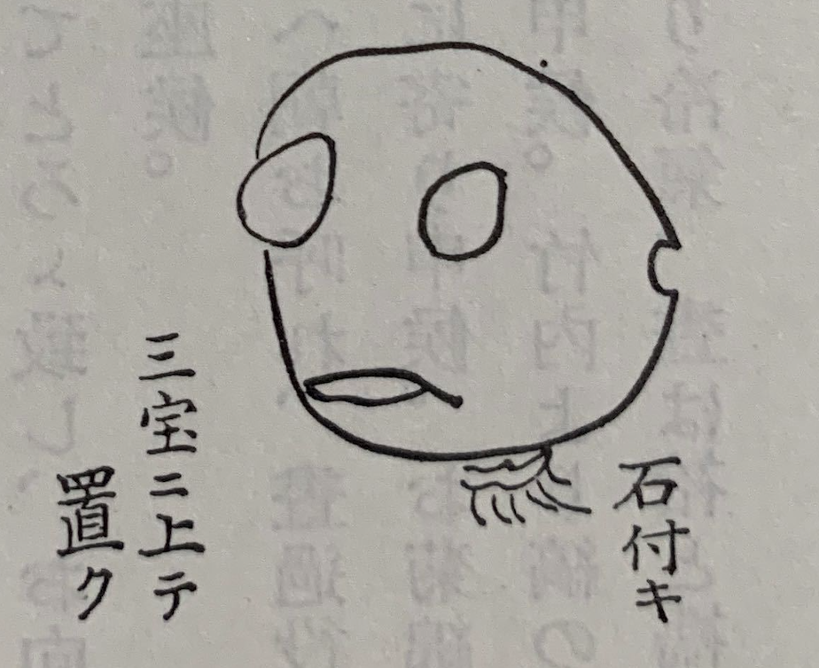

天気だったんですが、17時くらいから雲がでて、夕立になり雷も随分なっていました。
暮合から大降りでした。

昼まで役所に出て、その後学校に出勤しました。
20時くらいに帰宅したら、お手伝いのいせが
「子守で御門の外へいったんですが、一念寺という寺にキノコの化け物がいましたよ」
と言ってました。
みんな見物に行っていたので、私もいきました。たしかに恐ろしいものでした。
作り物なんじゃないかと思われるかもしれませんが、あれは自然の物でした。
太田と銭湯に行くついでに見に行ったんです。
本当に奇妙なものでした。

形はドクロのようで、大きさは90センチくらい。
真っ白で上に石垣の形がありました。
目のところは窪んで、口はイミワレています。
後ろにも小さな穴があって、香りはよかったです。
一晩で出来たらしいです。
墓所の垣の脇に出ていました。取ったあとも香りが残っていました。

